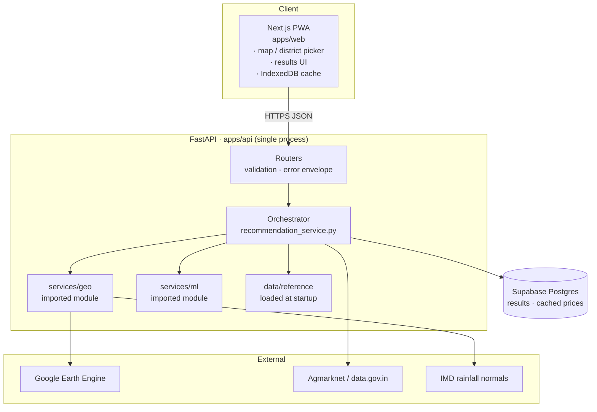
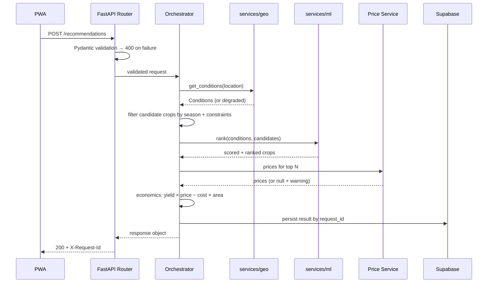
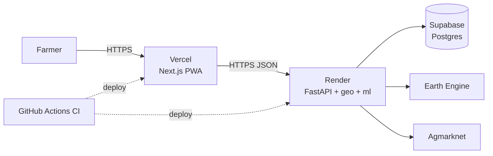

# Architecture

**Version:** 1.0 · **Last updated:** 2026-08-16
Companion documents: [`api-contract.md`](./api-contract.md) · [`data-sources.md`](./data-sources.md) · [`ai-design.md`](./ai-design.md)

---

## 1. What the system does

A farmer opens a web app, indicates where their land is, picks a season, and receives a ranked list of crops with suitability scores, sowing windows, and profit estimates.

Everything in this document exists to serve that one request path.

---

## 2. Design principles

These are the rules we resolve arguments with. Listed in priority order — when two conflict, the higher one wins.

1. **Explainability over accuracy.** A recommendation the farmer cannot understand is worthless, regardless of how good the number is. Every score decomposes into named factors.
2. **Degrade, never collapse.** If market prices are unavailable, still return agronomic advice. A partial answer beats an error page.
3. **One process until proven otherwise.** Distributed systems are a cost, not an achievement. We split a service only when there is a measured reason.
4. **Offline-tolerant frontend.** Rural connectivity is intermittent. The last result must survive a dropped connection.
5. **Every number has a source.** No figure appears in the UI without a traceable origin in `data-sources.md`.

---

## 3. System overview



**One deployable backend.** `services/geo` and `services/ml` are Python packages imported by the FastAPI app, not separate servers. They live in top-level folders to keep ownership boundaries clear for the team, and to leave the door open to extracting them later.

---

## 4. Components

### 4.1 `apps/web` — Next.js PWA

| Aspect | Choice |
|---|---|
| Framework | Next.js (App Router), TypeScript |
| Styling | Tailwind |
| Map | MapLibre GL + OpenStreetMap tiles |
| State | React Query for server state, local state otherwise |
| Offline | Service worker + IndexedDB |
| Deploy | Vercel |

Responsibilities: capture location three ways (pin, district, drawn polygon), collect season and plot details, render results, cache for offline.

Explicit non-responsibilities: **no agronomic logic, no economics maths, no unit conversion.** The frontend displays what the API returns. This is the single most important boundary in the system — it means there is exactly one place where a wrong number can come from.

### 4.2 `apps/api` — FastAPI

Thin HTTP layer plus orchestration.

```
apps/api/
├── main.py                    # app factory, middleware, X-Request-Id
├── routers/
│   ├── recommendations.py
│   ├── geo.py
│   ├── meta.py
│   └── prices.py
├── schemas/                   # Pydantic models mirroring api-contract.md
├── services/
│   ├── recommendation_service.py   # the orchestrator
│   ├── economics.py                # cost/yield/margin maths
│   └── price_service.py            # Agmarknet fetch + cache
├── core/
│   ├── config.py              # env vars via pydantic-settings
│   ├── errors.py              # error envelope, exception handlers
│   └── reference.py           # loads data/reference at startup
└── tests/
```

The Pydantic schemas are the enforcement mechanism for the API contract. If the contract says `area_ha` is a float between 0 and 100, that constraint lives in a Pydantic model and is impossible to violate at runtime.

### 4.3 `services/geo` — Earth Engine

Turns a `Location` into a `conditions` object: soil texture, pH, NPK, organic carbon, rainfall normals, current NDVI.

Interface, and the only thing the rest of the system may depend on:

```python
def get_conditions(location: Location) -> Conditions: ...
def resolve_admin(location: Location) -> ResolvedLocation: ...
```

Handles the three location types by normalising all of them to a geometry before sampling: a point becomes a small buffer, a district becomes its boundary, a polygon is used directly.

**Failure mode:** Earth Engine authentication expires, quota is hit, or cold start exceeds the timeout. On any failure `get_conditions` returns a `Conditions` object with `null` fields and `data_completeness` below 1.0 rather than raising. The orchestrator turns that into a warning, and the request still succeeds with reduced confidence.

**`USE_MOCK_GEO=true`** bypasses Earth Engine entirely and serves fixtures. This is how the rest of the team develops without credentials, and it is the demo fallback if the network fails on presentation day.

### 4.4 `services/ml` — ranker and forecaster

**Ranker — rules-based in v1.**

For each candidate crop, score each factor independently against ICAR agronomic thresholds, then combine with fixed weights:

```
score = Σ (weight_f × factor_score_f) for f in factors
```

Factor scores are 0–1, computed from published optimal ranges — pH inside the crop's ideal band scores 1.0, degrading toward the tolerance limits. Weights are declared in `services/ml/config/weights.yaml`, not hardcoded, so they can be tuned and defended.

Two properties this buys us:

- Every score decomposes into the named factors the API contract requires in `reasons`. Explainability is structural, not bolted on.
- No training data is required, so there is no dataset provenance argument to lose.

**Ranker — ML path, deferred.** The interface is designed so a learned model can replace the scorer without touching the orchestrator:

```python
class Ranker(Protocol):
    def rank(self, conditions: Conditions, candidates: list[Crop],
             constraints: Constraints) -> list[ScoredCrop]: ...
```

`RulesRanker` implements this today. A future `ModelRanker` would implement the same protocol and produce SHAP values to populate `reasons`. Selected via config, not code change. Rationale and rejected alternatives belong in `ai-design.md`.

**Forecaster.** Projects expected yield and price for the target harvest window. v1 uses historical averages from `data/reference` with a simple seasonal adjustment. Returns `null` rather than guessing when history is insufficient.

### 4.5 Supabase Postgres

Three jobs: persist recommendation results for the 30-day replay window, cache fetched market prices, hold reference tables that need querying.

RLS policies live in `db/policies.sql`. v1 has no auth, so results are readable by request ID — an unguessable ULID. Policies are written now so that adding auth later is a policy change, not a rewrite.

---

## 5. The main request path

`POST /api/v1/recommendations`, step by step.



Ordering rationale: geo runs first because ranking depends on soil and weather. Price lookup happens *after* ranking, for the top N only — fetching prices for all 40 crops when we return 5 would waste the slowest external call in the chain.

**Latency budget**, p95 target 4s:

| Stage | Budget |
|---|---|
| Validation | < 10 ms |
| Earth Engine sample | 1500 ms |
| Candidate filter | < 50 ms |
| Ranking | < 100 ms |
| Price fetch (cached) | 200 ms |
| Economics | < 50 ms |
| Persist | 100 ms |

Earth Engine cold start can push this to 15s. The frontend uses a 30s timeout with a progress indicator, and `/geo/field-summary` gives the farmer something to look at meanwhile.

---

## 6. Data flow and caching

| Data | Source | Refresh | Cached where |
|---|---|---|---|
| Soil, NDVI | Earth Engine | On request | Postgres, 7 days by geohash |
| Rainfall normals | IMD, static | Never | Bundled in `data/reference` |
| Crop calendars, cost tables | ICAR, static | Manual | Bundled, loaded at startup |
| Market prices | Agmarknet | Daily job | Postgres |
| Recommendation results | Computed | — | Postgres, 30 days |
| Reference lists | Postgres | — | IndexedDB on client |

Static reference data ships in the repo rather than the database. It is small, versioned with the code, reviewable in pull requests, and works with no network — which matters for the demo.

---

## 7. Deployment



| Concern | Approach |
|---|---|
| Secrets | Platform env vars. Nothing in the repo. `.env.example` lists names only. |
| GEE credentials | Service-account JSON as a base64 env var on Render, decoded at startup. |
| Migrations | `db/schema.sql` applied via Supabase SQL editor. Manual and reviewed in v1. |
| CI | Lint, type-check, unit tests, contract tests on every push. |
| Rollback | Redeploy previous Git SHA on both platforms. |

**Known risk — Render free tier sleeps after inactivity**, producing a 30–60s first request. Mitigation: a GitHub Actions cron pings `/health` every 10 minutes, and we warm the service manually before the demo.

---

## 8. Cross-cutting concerns

**Errors.** A single FastAPI exception handler produces the error envelope from the API contract. Route code raises typed domain exceptions; it never constructs an error response by hand. One place to change, one shape to test.

**Observability.** Structured JSON logs, every line carrying `request_id`. Stage timings recorded for the latency budget above. `/health` reports the reachability of Earth Engine and the database.

**Testing.**

| Layer | What |
|---|---|
| Unit | Scoring functions, economics maths — pure functions, no I/O |
| Contract | Fixtures in `data/seed/api-fixtures/` validated against Pydantic schemas in CI |
| Integration | Full request path with `USE_MOCK_GEO=true` |
| Manual | Demo script in `demo-script.md` |

The contract tests are the ones that earn their keep: they fail the build if the API and the documented contract drift apart.

**Security.** No auth in v1, so there is no session to steal. Input validation via Pydantic bounds all numeric inputs and caps polygon size. Rate limiting by IP on the recommendations endpoint. Service-role Supabase key never leaves the server; the client only ever holds the anon key.

**Internationalisation.** Crop names carry a `name_hi`. UI strings live in the frontend locale files. `lang` on the request affects returned display strings only, never identifiers or numbers.

---

## 9. Decisions and trade-offs

| Decision | Chosen | Rejected | Why |
|---|---|---|---|
| Service topology | Imported modules | Microservices | One deploy, one log stream, no inter-service failures during a timed demo. Folder boundaries preserve the option to split. |
| Ranking | Rules v1, ML behind a Protocol | ML from the start | Explainable by construction, no dataset provenance risk, and honest about maturity. |
| Reference data | Files in repo | Database tables | Version-controlled, reviewable, works offline. |
| Frontend | Next.js PWA | React Native | One codebase, installable, no app store, works on any phone with a browser. |
| Geo backend | Earth Engine | Self-hosted raster stack | Free for research, no data hosting, credible source. Accepted cost: cold starts and an external dependency. |
| Price handling | Cache + null on failure | Fail the request | Agronomic advice retains most of the value without prices. |
| Auth | None in v1 | Supabase auth | Removes an entire failure surface from the demo. RLS written so it can be added. |

Each row is a place a judge may probe. The rejected column is the part worth being able to defend out loud.

---

## 10. Known limitations

Stated plainly, because pretending otherwise is worse.

- Soil data is modelled at 250 m resolution, not a lab test of the farmer's actual field.
- Yield estimates are historical averages, not a prediction for this specific plot.
- Price forecasts do not account for policy shocks, MSP changes, or weather events.
- Coverage is limited to the districts present in `data/reference`.
- No pest or disease surveillance data feeds the risk field; risks are crop-typical, not current.
- Rules-based scoring weights are expert-set, not empirically validated.

---

## 11. If we had more time

Ordered by value per unit of effort.

1. Validate scoring weights against historical district-level yield data.
2. Extract `services/geo` into its own service to isolate cold starts.
3. Add LLM-generated plain-language explanations over the structured `reasons`.
4. Voice input and output in regional languages.
5. Crop rotation history per field, requiring auth and saved fields.
6. Live pest advisories from state agriculture departments.
